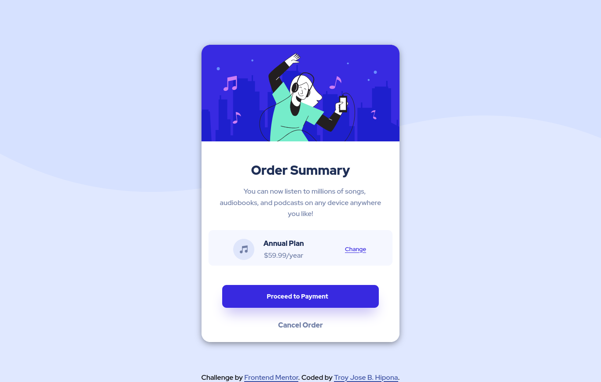

# Frontend Mentor - Order summary card solution

This is a solution to the [Order summary card challenge on Frontend Mentor](https://www.frontendmentor.io/challenges/order-summary-component-QlPmajDUj). Frontend Mentor challenges help you improve your coding skills by building realistic projects. 

## Table of contents

- [Overview](#overview)
  - [The challenge](#the-challenge)
  - [Screenshot](#screenshot)
  - [Links](#links)
- [My process](#my-process)
  - [Built with](#built-with)
  - [What I learned](#what-i-learned)
- [Author](#author)
- [Acknowledgments](#acknowledgments)

## Overview

  This project will improve your CSS Skill 

### The challenge

Users should be able to:

- See hover states for interactive elements

### Screenshot

### Links

- Solution URL: [Add solution URL here](https://github.com/troy03/oder-summary-component)
- Live Site URL: [Add live site URL here](https://github.com/troy03/oder-summary-component)

## My process

  -I use a mobile first approach and discover the responsive developer tools of firefox.

### Built with

- Semantic HTML5 markup but I use non-semantic tag (e.g div) to layout. 
- CSS custom properties
- Flexbox
- CSS Grid 
- Mobile-first workflow

### What I learned

  After creating a 6 newbie challenge including this project I learn about media queries, mobile-first approach and for the next project I will challenge myself to make a project that use specifically grid layout. 

## Author

- Frontend Mentor - [@troy03](https://www.frontendmentor.io/home)

- Github - [@troy03](https://github.com/troy03)

## Acknowledgments

Thanks  to MDN  W3SCHOOL that help me to solve this challenge.
